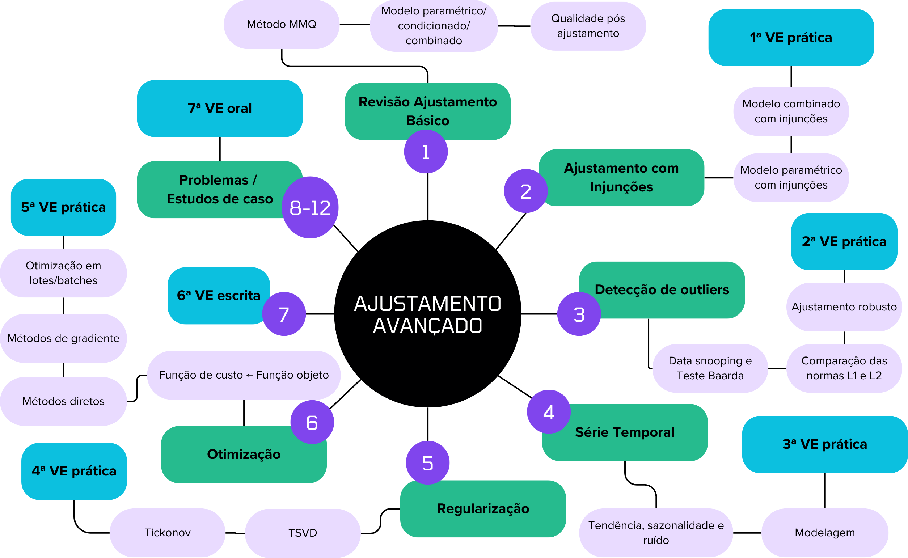

# Ajustamento Avançado IME

Aulas de Ajustamento Avançado (Inverse Problems) ministradas para o 3º ano do Curso de Engenharia Cartográfica do Instituto Militar de Engenharia - Rio de Janeiro/RJ



## SUMÁRIO:

- [Aula 1](https://github.com/HumbertoDiego/AjustamentoAvancadoIME/blob/main/01_revisao_ajustamento_basico.ipynb): Revisão de Ajustamento Básico — MMQ, modelos paramétrico, condicionado e combinado e qualidade pós-ajustamento.
- [Aula 2](https://github.com/HumbertoDiego/AjustamentoAvancadoIME/blob/main/02_ajustamento_com_injuncoes.ipynb): Ajustamento com Injunções — modelos combinado e paramétrico com injunções. **1ª VE prática.**
- [Aula 3](https://github.com/HumbertoDiego/AjustamentoAvancadoIME/blob/main/03_deteccao_de_outliers.ipynb): Detecção de Outliers — data snooping, teste de Baarda, ajuste robusto e comparação L1/L2. **2ª VE prática.**
- [Aula 4](https://github.com/HumbertoDiego/AjustamentoAvancadoIME/blob/main/04_series_temporais.ipynb): Séries Temporais — tendência, sazonalidade, ruído e modelagem. **3ª VE prática.**
- [Aula 5](https://github.com/HumbertoDiego/AjustamentoAvancadoIME/blob/main/05_regularizacao.ipynb): Regularização — TSVD e Tikhonov. **4ª VE prática.**
- [Aula 6](https://github.com/HumbertoDiego/AjustamentoAvancadoIME/blob/main/06_otimizacao.ipynb): Otimização — função objetivo, métodos diretos, gradiente e lotes. **5ª VE prática.**
- [Aula 7](https://github.com/HumbertoDiego/AjustamentoAvancadoIME/blob/main/07_avaliacao_escrita.ipynb): Avaliação escrita. **6ª VE.**
- [Aula 8](https://github.com/HumbertoDiego/AjustamentoAvancadoIME/blob/main/08_estudo_de_caso_1.ipynb): Rede de nivelamento com injunções.
- [Aula 9](https://github.com/HumbertoDiego/AjustamentoAvancadoIME/blob/main/09_estudo_de_caso_2.ipynb): Controle de qualidade e outliers em rede.
- [Aula 10](https://github.com/HumbertoDiego/AjustamentoAvancadoIME/blob/main/10_estudo_de_caso_3.ipynb): Série temporal de monitoramento.
- [Aula 11](https://github.com/HumbertoDiego/AjustamentoAvancadoIME/blob/main/11_estudo_de_caso_4.ipynb): Inversão regularizada.
- [Aula 12](https://github.com/HumbertoDiego/AjustamentoAvancadoIME/blob/main/12_estudo_de_caso_5.ipynb): Projeto integrador e defesa. **7ª VE oral.**

## REQUISITOS:

- [Python 3.12](https://www.python.org/downloads/)
- [Colab]
- [VS Code](https://code.visualstudio.com/) e [Extensão Jupyter do VS Code](https://marketplace.visualstudio.com/search?term=jupyter&target=VSCode&category=All%20categories&sortBy=Relevance)

No Windows PowerShell, macOS e Linux (Colab):

```powershell
pip install -r requirements.txt
```

<!--
git pull ajustamento main
git add * ; git commit -m "aula update"; git push ajustamento main
jupyter nbconvert --to slides 05_cond_sistemas.ipynb --TagRemovePreprocessor.remove_input_tags="hide_input" --SlidesExporter.reveal_scroll=True --post serve

reset
git init
git remote add ajustamento https://github.com/HumbertoDiego/AjustamentoAvancadoIME
git add * ; git commit -m "aula update"; git push ajustamento main --force
-->

