# DEPARTAMENTO DE CIÊNCIAS GEODÉSICAS

**Cálculos de Ajustamento 846** 

**Spring 1971**

## ABSTRACT

One of the major and tectonically most active earthquake fault zones in the united States is the San Andreas Fault System of California. In recent years various organizations have become engaged in research and measurements edge of earthguakes. One of these research programs now in progress is Geodimeter Trilateration. This program was begun in 1959 by the California Department of Water Resources to obtain vital fault movement information needed for planning and desigming the agueduct system.This study also indicated, however, correlation betwcen fault movement rates and recorded earthquakes. This suggested that continued measurements of fault movements might provide an effective earthguake warning system. Geodimeter

trilateration has been continued by the California Department of Conservation and currently involves precise measurements using a laser geodimeter. Some measured lines merely criss-cross the fault and are independent of any other lines. Other measured lines are part of closed geometric figures which enable least sguares adjustment and the evaluation of measurement precisions..This paper discusses the adjustment of precise Laser Geodimeter measurements of a five-point figure located near Hollister in the tectonically active area at the junction of the HaywardCalaveras and San Andreas Faults.

## INTRODUCTION

The earth's crust is regularily subjected to tectonic forces that originate from deep below the surface of the earth.Due to these forces, the earth's crust may bend for a time but upon reaching a limit it abruptly snaps The fracture along which and slips to a new position. the slippage occurs is called a fault, and the sudden snap Earthquakes is a release of.energy called an earthquake. are perhaps the most freightening and destructive of all natural phenomenon.With the shock of an earthquake,vibrations called seismic waves are generated which travel outward from the earthquake's epicenter.In the case of severe earthquakes, the vibrations may becone so violent that they literally shake apart all but the sturdiest of man's. structures leaving death and destruction behind.

One of the major and tectonically most active faults in the United States is the San Andreas Fault System of California. The location of this 600 mile long fault is shown in Figure l. It is estimated by geologists that slippage has occurred along this fault forpossibly l00 million years. Detailed studies have indicated that total accumulated slippage along the fault throughout this period may be as great as 350 miles. Displacements that have occurred along this fault in the past are readily apparent today in many places in the form of sharp lateral jogs in streams and fence lines, or as "s" curves in streets and other engineering works crossing the fault. As a result of the great San Francisco earthguake of l906, sudden shifts in excess of 20 feet were measured in certain places along the fault.

Man currently knows very little about the origin or nature of the tectonic forces wich cause earthquakes. He has been able to make certain observations, however, and make some deductions based upon them. Seismographic recordings through the years, for example, have demonstrated the tendency for earthquakes to re-occur along existing faults. It has also bccn noticed that slippage along faults is not always sudden or violent.1 In many areas movement has been continuous, although very slow, during periods of no recording of major seismic activity. Displacements in excess of one centireter per year, for example, have bcen measured in the floor of a large winery located directly over the fault near Hollister. Similar measurements have shown lateral aisplacements of about a half centimeter annually in the expansion joints of the football stadium of the University of California, Berkeley: This stadium is built directly over the Hayward Fault, an East Bay ancillary of the major San Andreas system.  The City Hall at Hayward is another example whcre one part of the structure is moving transversely with respect to the other and in this case the rate is about six millimeters annually.

There seems to be little doubt tnat man will never be able to prevent earthquakes.The altcrnative to prevention of earthquakes is to learn as much as possible about them and then develop ways of living with them. There are several agencics that have been or that are now engaged in earthquake research along the San Andreas Fault System. Included in these agencies are the Earthquake Mechanism Laboratory of the Department of Commerce,the U.s. Coast and Gcodetic Survey ational Oceanic and Atmospheric Administration),the National Center for Earthquake Research, the U.s. Geological Survey, the Division of Mines and Geology of the California Department of Conservation and the California Department of Rater Resources. The University of California, the California Institute of Technology, and the East Bay Council on Surveying and Mapping are also involved.In addition, municipal utilities, engineering firms and private surveyors and others are also contributing to the pool of earthquake knowledge.

Through continued research there is hope that man may someday be able to predict the occurrence oi earthquakes. But even if he cannot do this, he can at least cetermine earthquake danger areas along active faults and zone them against high risk commercial and residential land usage; he. can develop new structural designs and construction methods which will better enable buildings to withstand earthquake vibrations; and he can establish building codes to enforce the construction of safe buildings. In addition to these life saving measures, man can also adopt certain economic measures where earthguakes are concerned. He can, for example, avoid as much as possible crossing or coming in contact with active faults s systems and aqueducts.

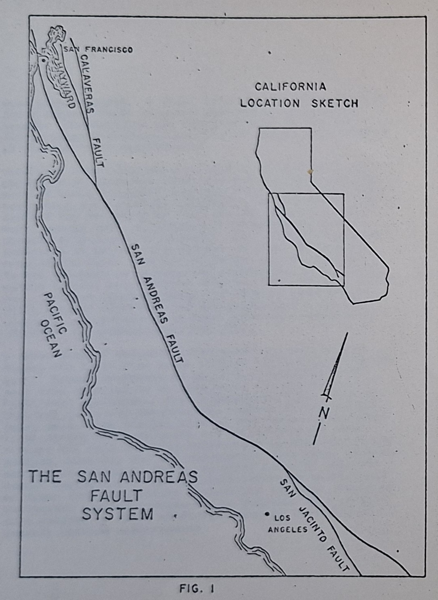

## CALIFORNIA WATER PROJECT

Following World War II rapidly expanding population in Southern California began to create an increasing shortage of water. Through studies it was determined that the shortage could most logically be alleviated by transporting water to that area via aqueduct from Northern California. Any aqueduct route from Northern California to Southern California's coastal population centers would, however, necessarily cross the San Andreas Fault System many times. Fault movement was immediately recognized as a definite nazard to the construction and maintenance of the aqueduct that would require careful planning and consideration.

During the 1950's the California Department of Water Resources became engaged in extensive planning activities to select the most favorable crossing sites for the aqueduct. Information needed to plan the water project included the amount, rate, and direction of fault slippage in the proximity of the project. Prior to the conccption of the California Mater Project, the only fault slippage information available was from a long range measurement program of the U.S.Coast and Geodetic Survey. This program involved repeat measurements at about ten year intervals on traverse and triangulation networks along the fault. More frequent measurements were not practical due to the slow rate of movement and the limited resolution of the surveying procedures that were then employed. A short term program for evaluating the necessary fault slippage information was clearly needed. The decision was therefore made by the California Water Resources Department to embark on a program of precise fault measurements.

Precision electronic distance measuring equipment was perfected at about the time that the California Department of Water Resources made the decision to begin gathering more data on fault slippage. The department recognized the potential of this new cguipment for their work, and in 1959,it adopted the Geodimeter in its program of precise mersurement.The Geodimeter program S crossed tne fault from San Francisco to Palm Springs. In the interest of economy and expedience,closed geometric figures were adopted only in areas of major interest.Without closed.figures, of course,simultaneous least sguares adjustment of the measurements was not possible. Measurements of most lines were repeated at intervals of approximately one year.

A great deal of valuable information was accumulated during the first nine years of this fault monitoring program. Annual movements of up to 4.4 centimeters per year were detected in an area along the San Andreas Fault near Hollister. This slippage rate was found to diminish to nearly immeasurable amounts in the Los Angeles area. The coastal side of the fault was detected to be moving north relative to the continental side. Perhaps the most striking information to come out of the program, however, was the observation that rates of movement often tended to change slightly prior to some recorded earthquakes. An important inference which could be drawn from this latter observation was that effective earthquake warning systems may be possible as a result of a stepped up fault monitoring program involving extremely precise measurements.

## LASER GEODIMETER MEASUREMENTS

In 1968 the California vcpartment of conservation, Division of Mines and Geology, engaged the scrvices of the firm of Greenwood and Associates of Sacramento to perform precise Geodimeter measurements along the fault. Mcasurement accuracies of l part in one million wcre desired. In using a Geodimeter to attain such accuracy, tempcratures to the,ncarest l degree Centigrade are neccssary. To attain the desired accuracies, a Laser Geodimetcr was used. During measurement an aircraft carrying two temperature probes was flown along side the laser beam. These probes were carefully calibrated and yielded a continuous curve of temperature along the line to the nearest o.l degree Centigrade. Baromctric pressure and humidity were also measured. At least six measurements were taken on each line.

One of the most active areas along the San Andreas Fault System is the area near Hollister. This is near the junction of the ancillary Hayward-Calaveras Fault with the major San Andreas Fault. This area has been the site of intensive measurement and study. The five-point figure shown in Figure 2 has been established in this.area for purposes of fault monitoring.T This figure has two stations on the continental side of the fault, two stations between the twc branches of the fault, and one station on the coastal side. The firm of Greenwood and Associates measured the nine lines of the figure during the period from September 22,1969 to 0ctober 7, 1969.  The method of measurement was as describea above. The observed distances were corrected for meteorological conaitions and reduced to mean sea level.Table I lists those mean sea level lengths.. This author was retained to perform a least squares adjustment of the measured data.

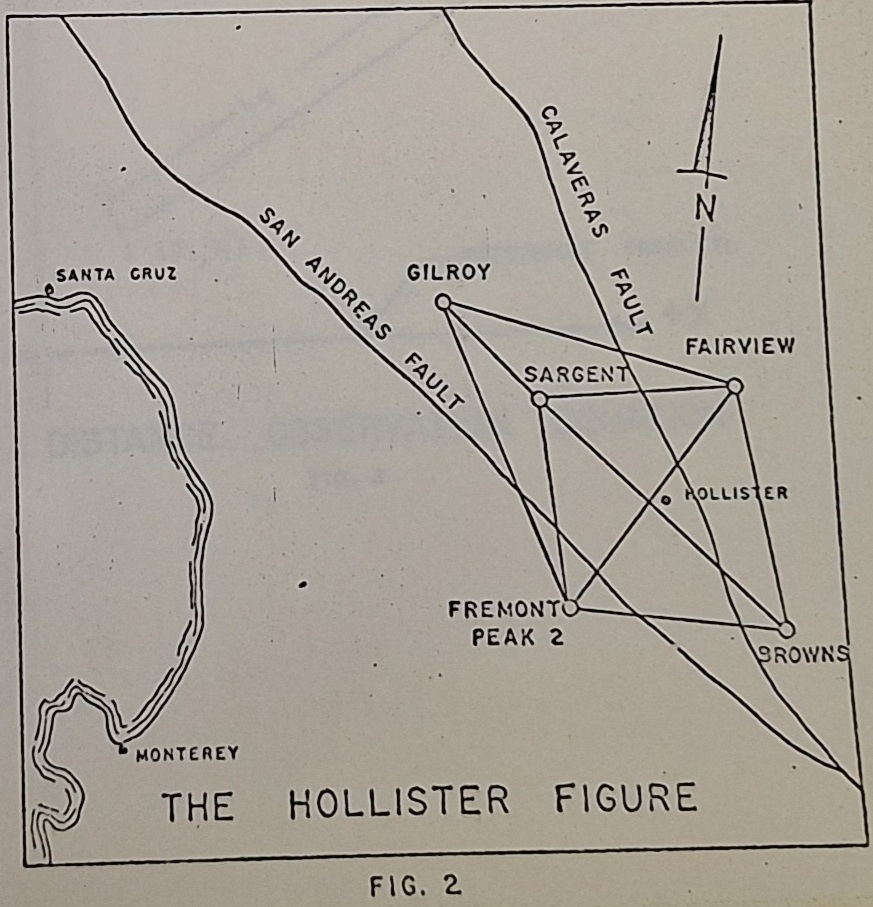

TABLE I

NEAN SEA LEVEL LENGTHS OF THE HOLLISTER FIGURE

| Line Designation          | Length (Meters)       |
|---------------------------|-----------------------|
| Fremont Peak 2- Gilroy | 26,648.5787 |
| Gilroy - Sargent | 11,720.6342 |
| Fremont Peak 2- Sargent | 16,596.9926 |
| Gilroy - Fairview | 23,845.0874 |
| Fremont Peak 2-Fairview |22,846.7442 |
| Fairview - Browms |  24,004.1514 |
| Fremont Peak 2-Browns| 25,177.3490 |
| Fairview - Sargent |14,858.2754 |
| Browns - Sargent | 32,526.8165 |

## OBSERVATION EQUATION METHOD OF LEAST SQUARES ADJUSTMENT

In adjusting horizontal positions in plane coordinates by the observation equation method of least sguares, eguations may be written which relate the observed values and their inherent rancom errors to the most probable x and Y coordinates of the points involved. This procedure is often referred to as the method of variation of coordinates.Referring to Figure 3,the following distance observation cguation may be written for any line $I-J$:

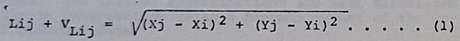

In equation (1), $Lij$ is the observed length of the line $I-J$, $V_{Lij}$ is the residual error in the observation and $Xi, Yi, Xj$ and $Yj$ are the most probable coordinatcs of the points $I$ and $J$. The right hand side of the equation is a nonlinear function of the unknown variables $Xi, Yi, Xj$ and $Yj$. The equation may be rewritten as:

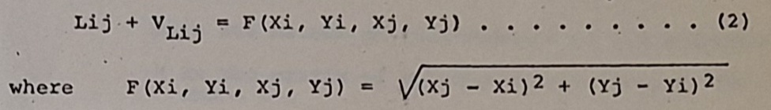

The Taylor Series linearization of the function $F$, after dropping as negligible all terms of order two or higher, takes the following form:

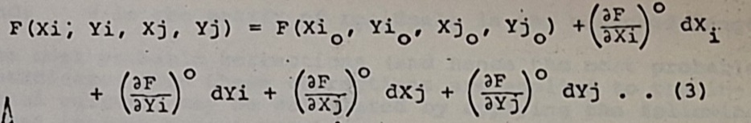

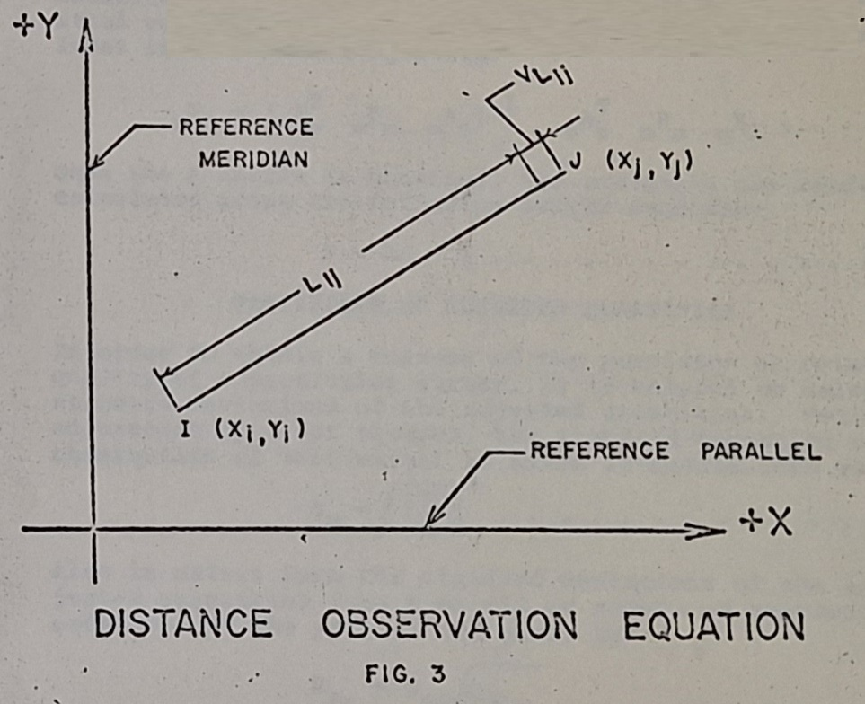

In equation (3), $Xi_0, Yi_0, Xj_0$ and $Yj_0$ are initial close approximations of the unknowns $Xi, Yi, Xj$ and $Yj$ and $dX_i, dY_i, dX_j$ and $dY_j$ are corrections to be applied to the initial approximations such that:

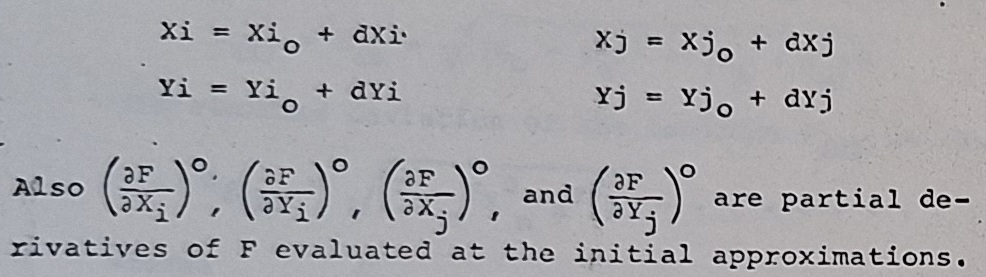

Evaluating the partial derivatives of the function F, substituting them into eguation 3 and then in turn substituting into equation 2,there results the following prototype linearized observation equation for distance measurements:

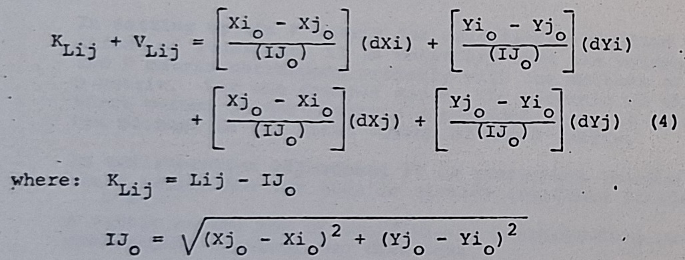

In the above eguation the only unknowns are the residual error and the small corrections to the initial approximations.The initial approximations are best calculated by simple intersection using a minimum amount of the actual observed data.

Using prototype equation 4 one observation equation is formulated for each observed distance. For an adjustment involving $m$ observations and $n$ unknowns, $m > n$, the resulting system of redundant observation equations can be represented in matrix form as:

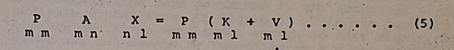

where: 

- $P$ is the matrix of weights of the respective observations;
- $A$ is the matrix of coefficients of the unknowns;
- $X$ is the matrix of unknown corrections, d X's and d Y's;
- $K$ is the matrix of constants, i.e., the measured lengths minus the lengths computed from initial approximate coordinates; e
- $V$ is the matrix of residuals in the measured lengths.

The most probable corrections (and hence the most probable coordinates when these corrections are applied to the initial values), may be calculated by applying the following least squares matrix equation:

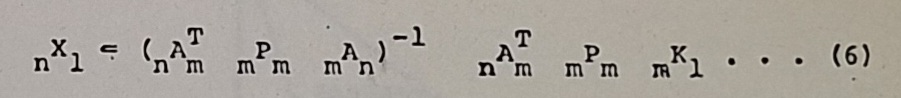

Once the X matrix is obtained, the residuals are readily calculated using the following matrix equation:

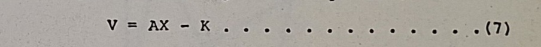

## PRECISIONS OF ADJUSTED QUANTITIES

In order to obtain a measure of the precision or relative quality of a particular survey, it is helpful to calculate standard deviations of the adjusted quantities.Following adjustment by least squares, the standard deviation of an observation of unit weight is given in Matrix form as:

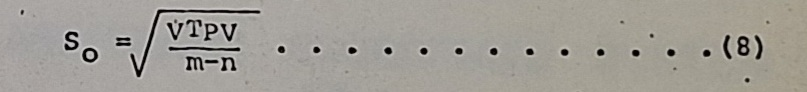

Also in matrix form the standard deviations of the adjusted quantities (the X matrix or matrix of unknown coordinates of the points) are given by:

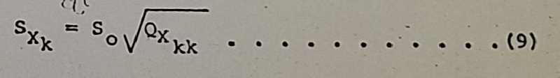

where:

- $S_{X_k}$ is the standard deviation of the $k^{th}$ unknown; and
- $Q_{X_{kk}}$ is the element in the $k^{th}$ row, $k^{th}$ column of the covariance matrix, ie, $(A^TPA)^{-1}$.

Standard deviations of functions of the adjusted guantities are also readily obtained,In trilateration adjustment, for example,it is of interest to calculate the standard deviations of the adjusted line lengths of the figure.This enables an expression of the precision of each mcasured line.The line length, AB for example, is expressed as a function of the adjusted unknow $X's$ as:

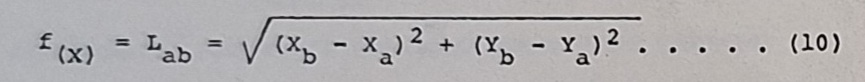

The standard deviation of the function $f_{(X)}$ is given as:

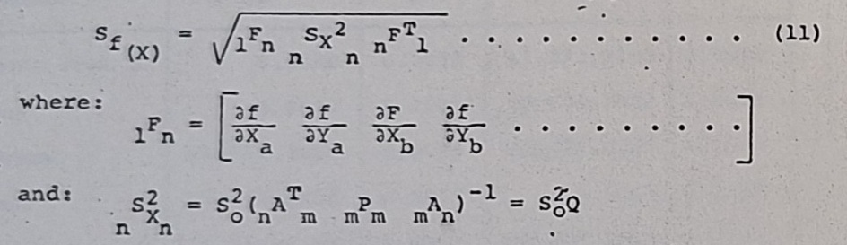

In setting up the $F$ matrix for calculating standard deviations of functions, it is necessary that the colunns of the $F$ matrix correspond properly with the columns of the $Q$ matrix. For the example above, the elements of the first column of the $Q$ matrix correspond to $X_a$ as this is the element in the first column of the F matrix.

In trilateration adjustment it is convenient to note that the $_{l}F_n$ matrix for any line is already available in the $A$ matrix as the row of coefficients corresponding to the observation equation for that line.

If probable errors (errors of 50 percent probability) are desired rather than standard deviations, it is simply necessary to multiply equations 8,9 and 1l by the constant 0.6745.

## ADJUSTMENT OF THE HOLLISTER FIGURE

In the adjustment of the five-point Hollister figure, the computations were performed in the arbitrary plane coordinate system shown in Figure 4. This was possible because the lines were short enough so that sigmificant error was not caused by computing in a plane coordinate system. Also since relative movements.were desired, an arbitrary system was acceptable. The arbitrary system that was adopted placed the Y axis coincident with the line from Fremont Peak to Gilroy. The direction of that line was held fixed by making and holding the x coordinates of Fremont Peak and Gilroy at zero. The X axis was placed perpendicular to Y and passed through Browns. ate of Browns at zero. With this choice of coordinate system, three of the ten coordinates of the five points were known to be zero and all other coordinates were made positive. and adjusted based on the nine observed distancesi a proThe seven unknown coordinates were calculated ceaure which yielded two redundant observations. Equal weights were used for all observations.

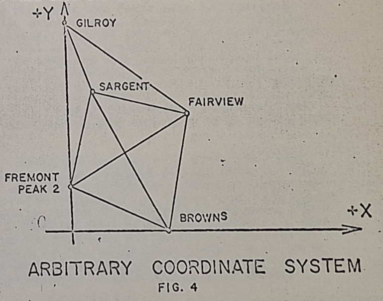

The observation equation method of least squares discussed in the previous section was used to adjust the figure. The computations were performcd on an electronic computer. Input data to the computer consisted of the mean sea level lengths listed in Table I.

The results of the least squares adjustment are presented in Tables II and III. Table II lists the adjusted coordinates and the probable errors of those coordinates for the five stations. Those probable errors were calculated by equation 9, except that equation 9 was multiplied by the constant 0.6745.Table III lists the adjusted lengths of the lines, the residuals in the measured lengths, and the probable errors in the adjustcd lengths. The probable errors of the adjusted lengths were calculated by equation ll, except that eguation ll was also multipiied by the constant 0.6745.

TABLE II

ADJUSTED COORDINATES AND THEIR STANDARD DEVIATIONS (METERS)

| Station   |   X | PX |   Y |  PY  |
|----------------|-------------|--------|-------------|--------|
| Fremont Peak 2 |  0.0000 | 0.0000 | 11,322.2130 | 0.0086 |
| Gilroy |  0.0000 | 0.0000 | 37,970.7932 | 0.0076 |
| Fairview   | 19,156.7017 | 0.0045 | 23,771.8837 | 0.0054 |
| Browns | 22,487.9204 | 0.0077 |  0.0000 | 0.0000 |
| Sargent    |  4,708.2175 | 0.0064 | 27,237.3923 | 0.0081 |

TABLE III (METERS)

ADJUSTED LENGTHS, RESIDUALS AND PROBABLE ERRORS

| Line  |   Adjusted Length |   Residual | Probable Error   |
|-------|-------------------|------------|------------------|
| Fremont Peak-Gilroy   |   26,648.5802 | 0.0015 | 0.0046   |
| Gilroy-Sargent    |   11,720.6317 |    -0.0025 | 0.0038   |
| Fremont Peak-Sargent  |   16,596.9950 | 0.0024 | 0.0043   |
| Gilroy-Fairview   |   23,845.0886 | 0.0012 | 0.0048   |
| Fremont Peak-Fairview |   22,846.7398 |    -0.0044 | 0.0046   |
| Fairview-Browns   |   24,004.1553 | 0.0039 | 0.0047   |
| Fremont Peak-Browns   |   25,177.3523 | 0.0033 | 0.0048   |
| Fairview-Sargent  |   14,858.2787 | 0.0033 | 0.0045   |
| Browms-Sargent    |   32,526.8101 |    -0.0064 | 0,0041   |

## SUMMARY

The adjustment of the nine line five-point Hollister figure yielded a maximum residual of 0.0064 m.This occurred in a line which is over 32 kilomcters in lcngth and represents a rcsidual to length ratio of about l part in 5,ooo,oo0. The lowcst such ratio was about l part in 4,5oo,ooo, and the average for the rine lines of the figure was approximately'l part in 9,ooo,ooo. Bascd on crustal movement ratcs which have already bcen observed along the fault, the precision capability demonstrated on the Hollister figure is easily sufficient to determine fault slippage, and these determinations could be made at more frequent time intervals than those of the past.

Regular re-measurement of established figures and of new figures along the fault can contribute substantially to man's knowledge about crustal novcment and earthguakes. Each newly measured group of lengths, when entered into the computer, will instantaneously yield new computed positions of the stations comprising the closed figures. Comparisons of'these positions with those of previous measurements will yield slippage rates. Closcd geometric figures will enable least sguares adjustment of the cata, a procedure which provides measurement precisions and enables the detection of any unusually large errors that might occur.

Many years of continued measurements along the fault, closely correlated with recordcd seismic activity could result in an effective earthguake prediction system on the basis of fault slippage.It may be that such a prediction system can never becone reality, however, thcre is evidence indicating that it may be possible.A good start has already been made but continued research is needed.In view of the destructive potential of earthquakes, this generation must pioneer long term research which could ultimately benefit future generations.